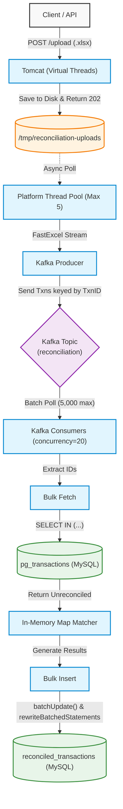

# High-Throughput Transaction Reconciliation System

A robust, highly optimized event-driven architecture designed to reconcile massive volumes of financial transactions (200 Million+ per hour). This system reads multi-gigabyte `.xlsx` files, streams the data through a Kafka messaging pipeline, and reconciles incoming client data against internal Payment Gateway (PG) records with zero database locking overhead.

---

## 🏗 System Architecture

The application is split into two asynchronous halves: **File Ingestion** and **Kafka Reconciliation**.

---

## 🧠 Key Architectural Design Choices

To process **~55,000 transactions per second**, standard CRUD/JPA approaches completely fail. Every layer of this application was designed to prioritize Memory Bounding, Batching, and Asynchronous processing.

### 1. Memory Bounding: Virtual vs. Platform Threads (Java 21)
When handling 200 concurrent file uploads of 1M rows each, the system faces two bottlenecks: I/O (waiting for network) and Memory (storing Excel shared string tables, ~100MB per file).
*   **Virtual Threads for HTTP (`spring.threads.virtual.enabled=true`)**: Tomcat uses lightweight virtual threads to accept hundreds of concurrent uploads, write them to disk, create a `QUEUED` database record, and immediately return `202 Accepted`.
*   **Platform Threads for Processing (`AsyncConfig.java`)**: We strictly bound the actual file processing to **5 platform threads**. This guarantees the JVM heap will never hold more than 5 Excel Shared String tables (~500MB max) at any given time, completely eliminating `OutOfMemoryError` crashes at scale.

### 2. Streaming XLSX Parser (FastExcel)
Instead of Apache POI (which loads the entire file into RAM), we use **FastExcel**. It streams the `.xlsx` file row-by-row directly off the disk, keeping memory consumption flat regardless of whether the file has 500,000 or 50,000,000 rows.

### 3. Bulk & Batch Database Operations
To prevent crushing the database with 55k individual queries per second:
*   **Bulk Fetch**: The Kafka consumer pulls 5,000 messages at once. It extracts the IDs and executes exactly **one** `SELECT * FROM pg_transactions WHERE transaction_id IN (...) AND is_reconciled = FALSE`.
*   **Bulk Insert/Update**: Once matched in Java RAM, results are saved using Spring's `JdbcTemplate.batchUpdate`. We added `rewriteBatchedStatements=true` to the MySQL JDBC URL, which compresses the 5,000 inserts into a single network packet, boosting throughput by up to 10x.

### 4. Data Structure Optimization (Micro-Optimizations at Scale)
When processing 200 million transactions, standard object allocation overhead becomes a major bottleneck. For our O(1) in-memory matching map (`Map<String, List<PgTransaction>>`), we explicitly use `ArrayList` instead of `LinkedList`:
*   **Memory Allocation:** A `LinkedList` requires allocating a new `Node` wrapper object for every single entry. For 200M transactions, this generates 200M unnecessary objects, triggering severe Garbage Collection (GC) pauses. `ArrayList` uses flat, contiguous arrays.
*   **CPU Cache Locality:** Iterating through a `LinkedList` to find partial refund amounts causes CPU cache misses because nodes are scattered in memory. `ArrayList` elements are contiguous, allowing the CPU to pre-fetch them into the L1/L2 cache instantly.

---

## 🛡 Robustness & Concurrency Solutions

Financial reconciliation introduces critical race conditions and logical hurdles. Here is how this architecture permanently solves them.

### The Multi-Capture / Partial Refund Problem
**The Issue:** A single `transaction_id` might correspond to 1 Capture and multiple Partial Refunds (e.g., $10, $20, $5). If a client uploads their refund records out-of-order, a naive queue might mistakenly compare the client's $20 refund against the PG's $10 refund and trigger an immediate `AMOUNT_MISMATCH`.
**The Solution:** Our in-memory matching algorithm groups the bulk-fetched PG transactions into an `ArrayList`. Before extracting a match, it iterates through the list looking for an **exact amount match**. This guarantees that out-of-order partial refunds pair with their exact counterpart safely.

### The Double-Matching Bug
**The Issue:** If a client accidentally uploads the same refund file twice, or two partial refunds with identical amounts arrive simultaneously, two separate worker threads might fetch the same PG record and successfully reconcile it twice. Result: 1 PG refund matched to 2 Client refunds.
**Standard Fix (Flawed):** Standard systems fix this with Database Row Locking (`SELECT FOR UPDATE`). However, row locking 55,000 times a second creates massive database contention, deadlocks, and destroys horizontal scalability.

### The Solution: Kafka Partition Affinity
We completely bypass database locking by solving the concurrency problem at the messaging layer:

1.  **Keyed Messaging:** In `TransactionKafkaProducer.java`, we send individual transactions to Kafka using the `transactionId` as the Kafka message key.
2.  **Partition Routing:** Kafka mathematically hashes the key. This guarantees that **all** events (Capture, Refund 1, Refund 2) for `TXN-001` will ALWAYS route to the exact same Kafka partition (e.g., Partition 4).
3.  **Strict Thread Binding:** Kafka guarantees that a single partition is consumed by **exactly one thread** across your entire horizontal cluster. 

By setting `spring.kafka.listener.concurrency=20` (and `groupId=reconciliation-group`), we spin up 20 parallel threads that process 20 different partitions simultaneously. However, because of Partition Affinity, it is mathematically impossible for two threads to process `TXN-001` simultaneously. 

**Result:** Zero race conditions, zero database locks, and perfect horizontal scalability.
